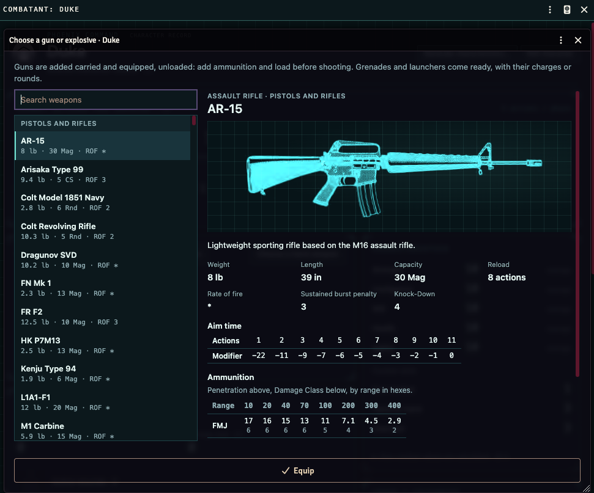

# Phoenix Command for Foundry VTT

A Foundry Virtual Tabletop system for the Phoenix Command Small Arms Combat System, published by Leading Edge Games © 1989. It runs the combat clock, character sheets, and weapon catalogue on a hex map, so an ordinary shot or move does not mean re-entering the tables by hand.

Use it with your copy of the book. This software is not published by Leading Edge Games.



## Install

Foundry VTT **14**. On the setup screen, open **Game Systems**, choose **Install System**, and paste this manifest URL:

```
https://github.com/mbutler/foundryvtt-phoenix-command/releases/latest/download/system.json
```

Foundry downloads the matching release and installs it as `phoenix-command`. Later releases are offered as updates from that same URL.

## At the table

- A hex map at **6 feet per hex** for small-arms combat.
- A token for each combatant.
- A Combat encounter. The GM starts it from the Combat Tracker.
- Players select their token. The action bar opens above the hotbar.

## License

The software is [MIT](LICENSE), © 2026 Matthew Butler. Phoenix Command Small Arms Combat System is published by Leading Edge Games © 1989.

Questions and bugs: [open an issue](https://github.com/mbutler/foundryvtt-phoenix-command/issues).
